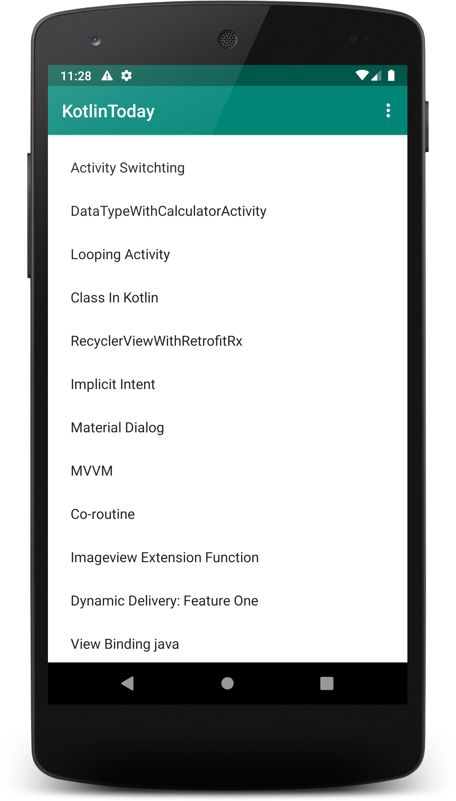
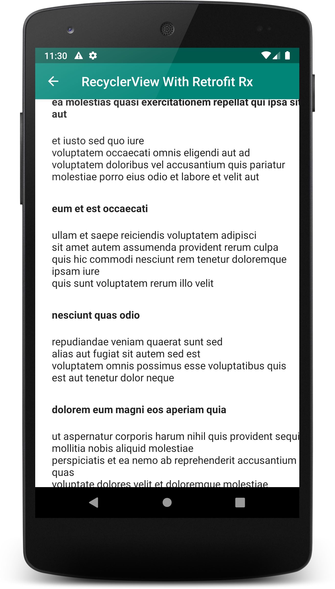

# KotlinToday
Use kotlin an efficient way in Android. A beginners to Pro Repository. I try to update this repo with 
all latest updates from Android Jetpack Component and best practice recommended by Google.

Current View

 

Currently This Features are as follows
-	Activity Switching
-	DataTypeWithCalculatorActivity
-	Looping Activity
-	Class In Kotlin
-	RecyclerViewWithRetrofitRx
-	Implicit Intent
-	Material Dialog
-	MVVM with Dagger: Hilt
-   Jetpack Paging 3.0
-	Co-routine
-	Imageview Extension Function
-	Dynamic Delivery: Feature One
-	View Binding java
-   Parcelable Implementation
-   Firebase Analytics, Crashlytics, Dynamic delivery
-   Github Action (CI-CD)
-   Todo ( Viewpager 2.0, Jetpack Compose, Kotlin Flow) & More

Application is available in [Google Play Store](https://play.google.com/store/apps/details?id=com.shihab.kotlintoday).
